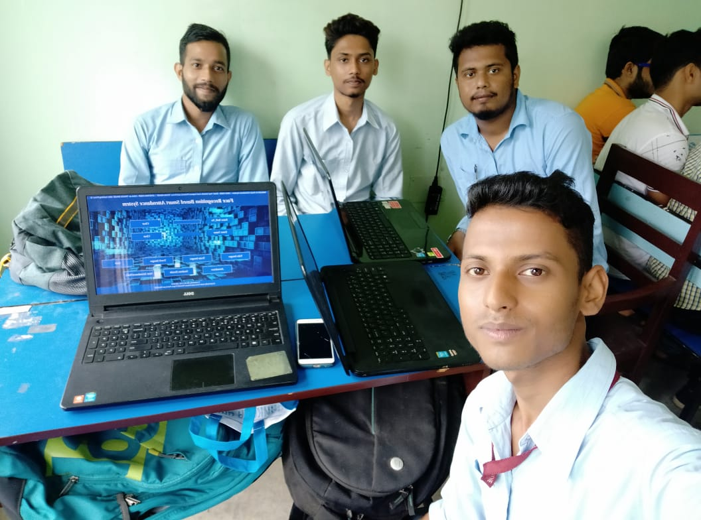
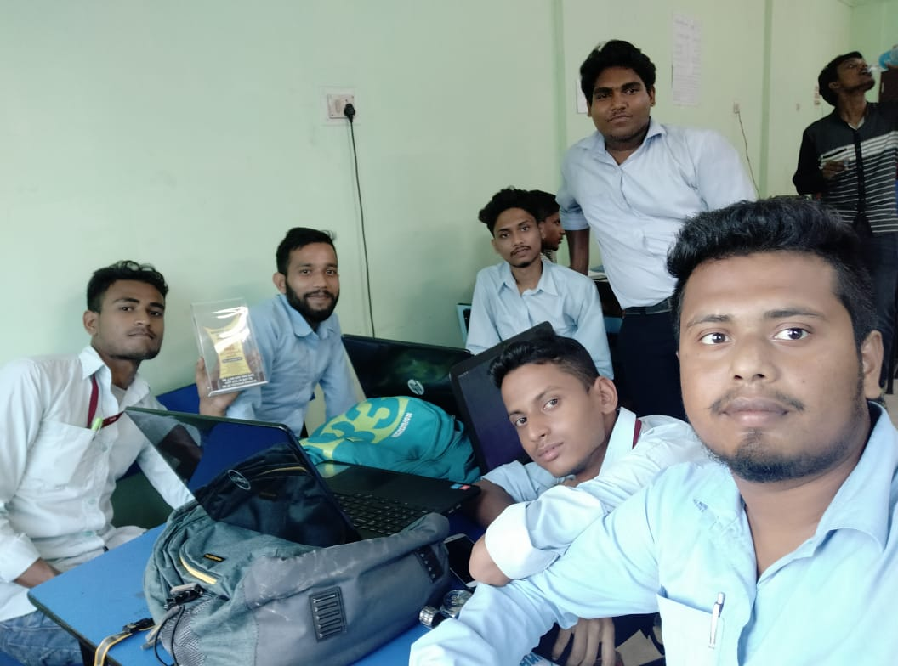

 ::22nd Foundation Day::  :Vikram Saravai Innovation Contest:

### Our Project Name :
    _Face Recognition Based Smart Attendence System_

### Creators :
    1. Ayan Mondal.
    2. Suman Mandal.
    3. Amit kabi.
    4. Amit Ghoswami.
    5, Tapas Pal.

### Tools and Technology Used :
    Python3.
    Numpy.
    Pandas.
    tkinter.
    Open CV.
    Linux Enviroment.
   
## Memories of That day 

### :sunglasses:
